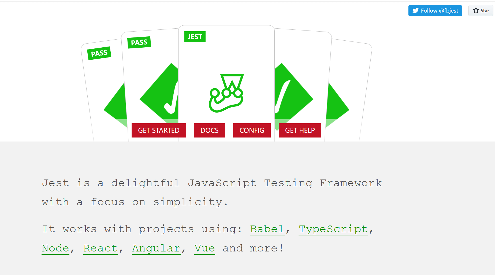

[简体中文](./README.md) | English

# Jest diving
> ## Talk is cheap. Show me the code.

> ### Points in Jest learning

* ### jest-starter
> The main reference is the Jest guide booklet. The content of the booklet is very detailed. It does well for following the booklet, with it, we can reviewing the knowledge points of Jest which will greatly improve the usage of Jest.

  [Jest guide](https://github.yanhaixiang.com/jest-tutorial/)
