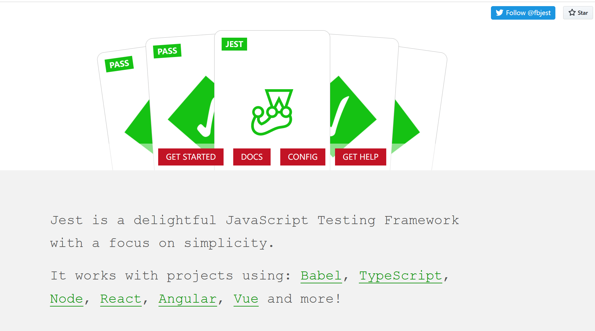

简体中文| [English](./README.en-US.md)

# Jest 深入学习
> ## Talk is cheap. Show me the code.

> ### 记录Jest中的一些学习要点.

* ### jest-starter
> 主要参考了Jest指南小册子, 小册子的内容很详细, 跟着学习或是复习Jest的知识点, 提升很大。

  [Jest实践指南](https://github.yanhaixiang.com/jest-tutorial/)
